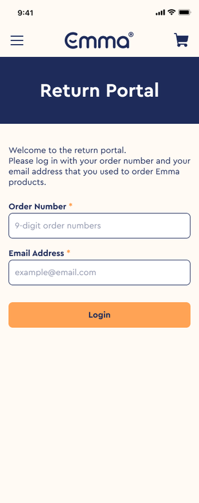

import { ImageGrid } from '@site/src/components/ImageLayout'; import Vimeo from
'@site/src/components/Vimeo';

# Automating Return Orders

## Company & Product Background

Emma Sleep GmbH is one the fastest growing Sleep Techs in Europe. The company
has been operated since 2013 and now the brand is active in more than 30
countries around the globe.

The core product is Bed-in-a-Box, which is available to purchase online via Emma
Sleep website. Apart from the product, Emma Sleep brand offers a unique selling
point, which is 100-nights-free trial for all their products. This policy allows
customers to return and get a refund of the product whenever they want during
the trial period.

## Problem & Goal

The return policy has resulted in the soaring amount of workload for customer
service agents due to the manual process of return initiating from the
customers, which leads to a significant delay for the return and increases the
customer complaints on the issue.

Working together with operation and logistic team, we started a project called
Self-service Portal. The portal offered customers to return products by
themselves without contacting a customer service. It aimed **to reduce a delay
on return process for customers, to lessen the customer service workload on the
manual process, and to provide a suggestion to prevent a return**.

## My role

I am a solo UX/UI designer on the project. Not only did I work with operation
and logistic team, I also collaborated with customer service team gathering
complaints from customers and data on return orders to support my design
decision.

## Gathering data

Return orders were manually processed through calls and emails, each customer
would provide a return reason for a product during the return request. This data
was documented by customer service team.

For example, in the UK, one of the major return reasons for the mattress was
that **"the mattress is too firm"**. Here, to counter the return reason, we
offered a complimentary foam layer for free-of-charge for customers. If they
take this offer, we will also extend their 100-night trial for them to adjust
with the product. This offer was shown to be a success by decreasing
approximately 60% of the mattress return rate.

I mapped out the user flow and possible use cases using all the return reasons
for the self-service return portal, as well as the counter offers and some
suggestions to improve the user experience with the physical product and prevent
return orders.

## Introducing a new return strategy

During the research period, I encountered many questions from the customers
asking whether or not the company resells the returned products. Therefore, we
decided to develop a new product strategy called "Charity Mattress" to reassure
customers that we don't resell our mattress.

I supported the production and logistic teams on customer communication for the
Charity Mattress project by providing content design for transactional emails
and digital communication. Charity Mattress aims to donate the mattress to
disadvantaged groups such as refugees. We were able to execute the donation in
Spain and Portugal. With this program, the charity will pick up the mattress
directly at the users' place and then after the return has been confirmed, the
refund would be initiated.

## Design

The self-service portal was available for customers to access via an email sent
by customer service team. After the implementation, the performance within the
first 3 motnhs showed that The return rate was not increased. The easiness of
the self-service automation did not mean that it will encourage the users to
return the products.

<ImageGrid columns="3">

</ImageGrid>

## Impact

The return rate for the reason "mattress too firm" was **reduced by about 60%**.
The return rate for other products was **decreased by about 18%** due to the
counter solutions for the return reason. The feature helped to **reduce the
customer service hours on processing the return approximately 20 hours per
week**. 100% of the returned mattresses in Spain and Portugal were able to
donate to the charity.

<Vimeo src="https://player.vimeo.com/video/852145647" />
