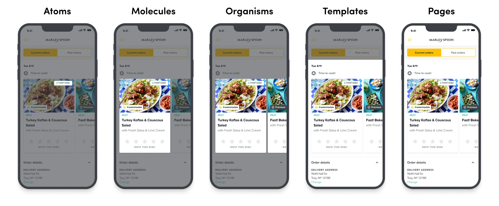
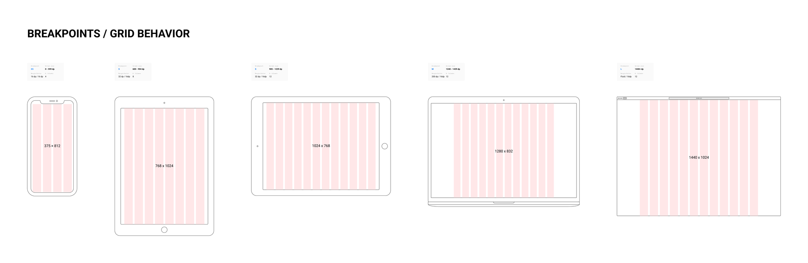
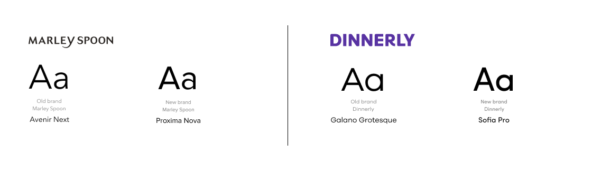
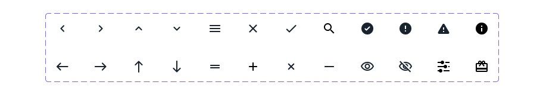
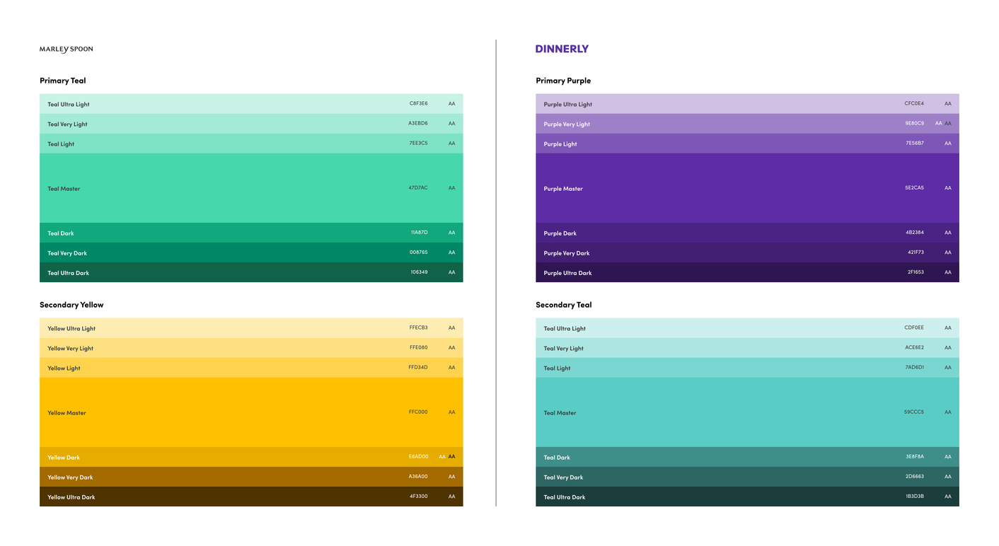
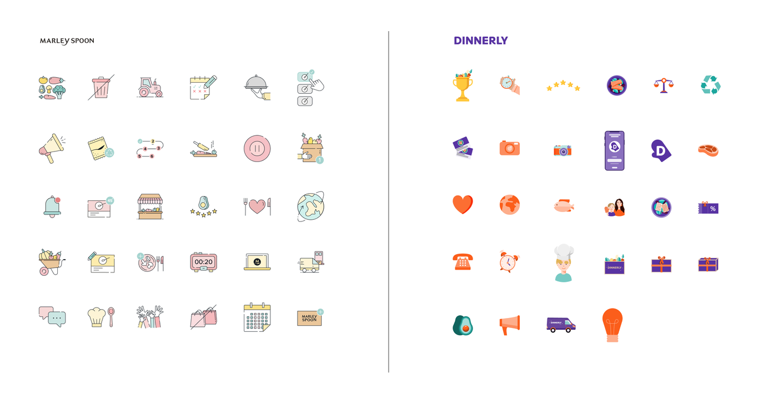
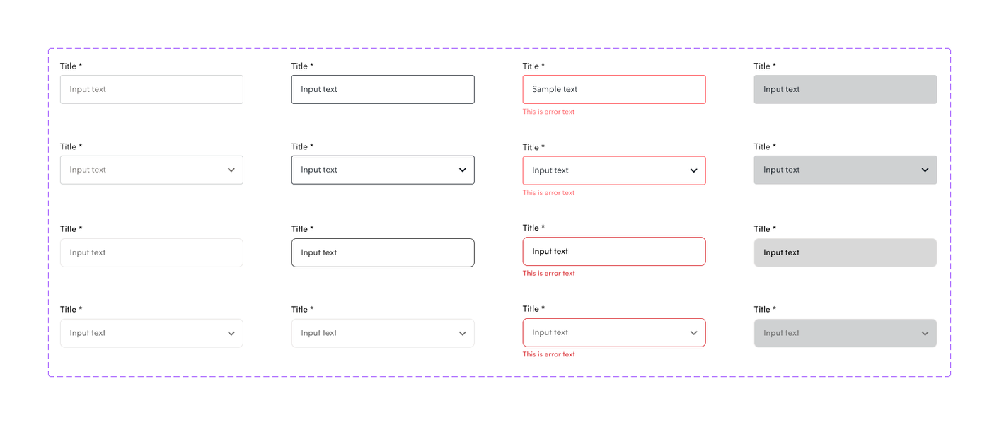
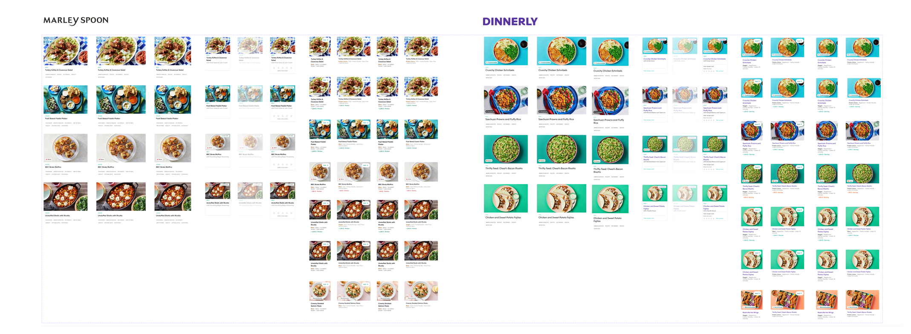
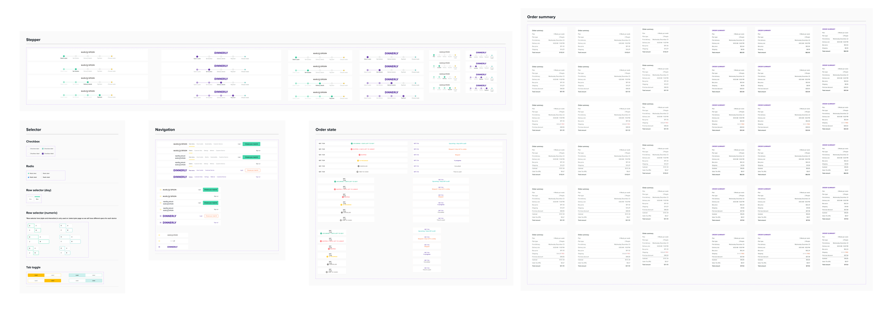

# Building the First Web Design System

Marley Spoon, a meal kit subscription service that gained popularity during the pandemic, decided it was time for a fresh look. The brand revamped itself with branding—new typography, colors, the whole look and feel. However, the digital product of the company didn't get a chance to rebrand itself at the same time. As a product designer at Marley Spoon, I found myself in the middle of this problem, tasked with creating a design system that would bridge the gap between our spiffy new branding and our online presence.

Marley Spoon isn't the only brand in this project. There's also Dinnerly, our sibling brand, dealing with similar design challenges. Both brands needed a way to make their digital spaces match their new looks.

## Navigating the Challenge

It's not just about swapping logos and colors. Our web development was stuck in legacy mode, making it a real pain to update the user interface to match the new branding. **My primary goal was to establish a design system and component library for Marley Spoon's web application.** This framework aimed not only to synchronize old and new branding but also to facilitate collaboration, streamline communication, and provide a structured approach to design patterns.

## The Essence of Design System

I decided to focus on **a component library** as the core of our design system. I understand that design system evolve with purpose, starting with a baby step of building a component library would **enable quick communication, foster adaptability in the face of rapid changes, and promote consistent design practices across the team.**

## Methodology

When it came to structuring the design system, I took a methodology called **Atomic Design**, an approach pioneered by Brad Frost. This methodology provided a structured hierarchy ranging from fundamental "Atoms" to complete "Pages." This structure matched with my goal of creating a comprehensive component library that seamlessly integrated all design elements.

## Grid System

I used Google Material Design's grid system to ensure that whether users are on a desktop or phone, the experience is consistent. No awkward shifts when they switch devices.

## Typography

The design system uses Avenir Next as the primary font, with Proxima Nova introduced for specific pages due to the rebranding. Dinnerly followed a similar path using Galano Grostesque as the primary font and Sofia Pro as another font for some pages.

## Iconography

I opted for Material Design Icon library because it's simple and informative. This icon set became the universal language across platforms.

## Color Palette

By changing the primary color between web and mobile, I kept the essence of the look and feel and ensured the harmony betweek platforms.

## Illustrations

Pictures speak louder than words, especially during user discovery phase of the brands. The illustrations took on a clean and vibrant style, guiding users through our story.

## Buttons

Buttons might seem basic, but they're big players in design patterns. I documented every button's look and behavior from active, hover, focus, pressed, loading, and disabled. All those little interactions surely make a difference.

## Input fields

I didn't just design how forms and fields look, but how they behave similar to button states, starting from active, hover, focus, to disabled. Accessibility is a key.

## Recipe cards

After all, Marley Spoon and Dinnerly are a meal kit company. Recipe cards took spotlight. They included images, titles, tags, prices, ratings and more, adapting responsively across all screens.

## Other components

There are many more components. Weekly order statuses, summaries, and a bunch of meal-kit-related stuff. I made sure consistency remained the foundation in the design ecosystem, giving thoughtful ux patterns.

Here we are, Marley Spoon's debut web design system was born—a practical fusion of design elements and brand identity. Guided by Atomic Design, the component library became the go-to for consistency, teamwork, and understanding.