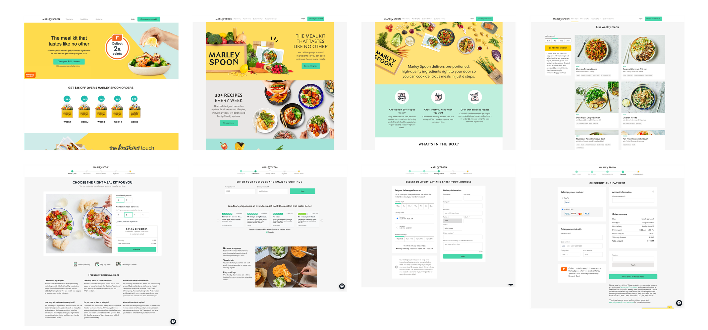
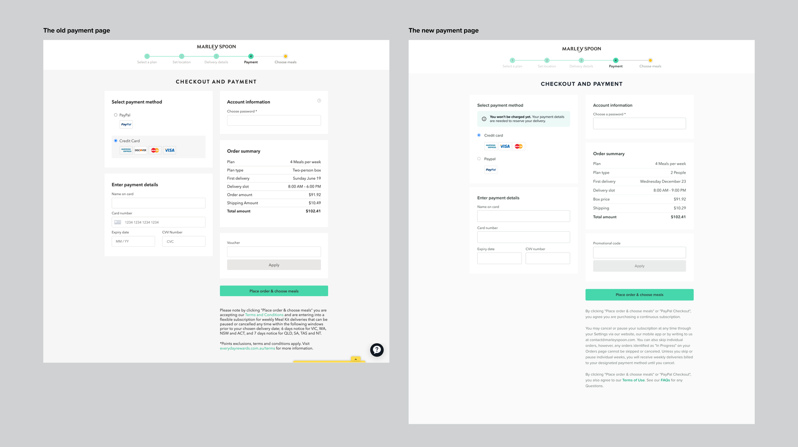
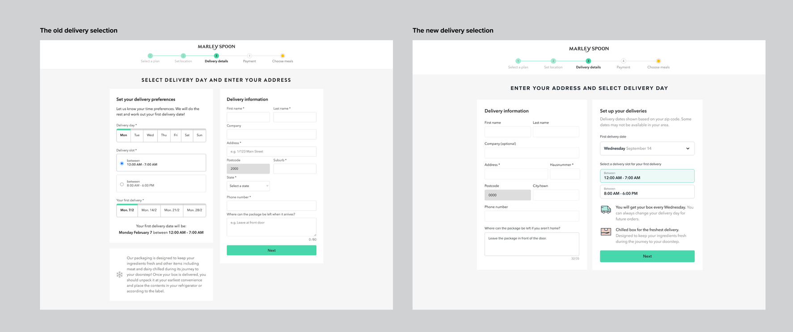

# Growth Design with User Research

In the competitive landscape of meal kit subscriptions, Marley Spoon has made its mark by delivering convenient home-cooked experiences to customers in 7 countries, with Australia and the USA as the biggest markets. Their focus on pre-portioned ingredients and diverse recipes has resonated with those who seek ease without sacrificing flavor. Since 2014, Marley Spoon has 500K active subscribers and over 1 million meals served, embodying convenience and culinary innovation.

The meal kit industry is bustling with promotions and vouchers to attract newcomers. Marley Spoon needed to stand out. Working UX researcher and product manager, we started a mission to improve Marley Spoon's growth strategy through design and research. This project, marked by collaboration and data-driven insights, aimed to enhance the user acquisition process, make the signup-to-first delivery experience smoother and more user-friendly.

## Preparing for User Research

Teaming up with a Senior UX Researcher, our goal was to conduct moderated interviews with users from key markets like the US, Australia, and Germany. We selected 30 participants in total who were familiar with meal kit services but new to Marley Spoon. Each interview, lasting about 45-50 minutes, dived into their initial impressions of Marley Spoon's website.

## A Testing Flow

We put eight key pages, mirroring the typical user journey from landing on the marketing page to navigating the menu and signing up. This comprehensive approach aimed to capture authentic user sentiments and feedback.

## Insights

The interviews revealed some interesting insights. The signup discount was a clear winner. It resonated with 93% of users. Delicious meal images earned univerally praise, sparking interest in exploring the brand further. 28% of participants appreciated the diverse weekly menu, connecting it to positive emotions.

However, we also encountered pain points. Users expressed displeasure with choosing meals after making payments (87%). Some participants (37%) found the delivery selection process redundant yet straightforward. The presentation of discounts (20%) during signup also raised confusions and questions.

## From Research to Design: Practical Solutions

From these findings, I formulated design solutions for A/B testing:

## An Altered Signup Flow

To tackle users' frustration with selecting meals after payment, I introduced a variant design. This approach allowed users to pay a few days before delivery, achieving a balance between user flexibility and business needs without compromising the whole signup flow. 

The impact was significant. **There was an impressive 10% increase in conversion between payment and meal selection.** Despite a subsequent rise in cancellation rates and payment failures by 7%, the variant's long-term value (LTV) of customers increased by 3%. Moreover, the basket size for the first order grew by 4%, with premium recipe additions by 20% of users and market items by 38%.

## Reducing Lead Time for First Delivery

Recognizing the impatience surrounding first delivery, I introduced a design that pre-selecting the fastest delivery dates, we shortened the lead time to an average of 3.7 days. This is a game changer for the brand.**The outcome showed that the new design slashed first order cancellations by a staggering 74%.** This success prompted plans to further reduce lead times to a window of 48 hours, enhancing the signup to first delivery experience and driving additional revenue.

