import { ImageRow } from '@site/src/components/ImageLayout';

# Rethinking the Referral Program

## Company & Product Background

Marley Spoon is a meal kit service that enables customers to make meal at home
by sending recipes and ingredients directly to the door. Marley Spoon is
currently operating in 7 countries, where Australia and the USA are the main
regions. Up until now there are about 500K active subscribers and more than 1
million meals have been served.

## Problem & Goal

Many customers had expressed that Marley Spoon did not show any appreciation for
the customers who are the brand advocate recommending Marley Spoon to their
family and friends.

The company decided to change the referral program by giving out a reward to a
referee whenever the referral is redeemed. The goals of this project are to
**reward customers whenever they refer a friend and to prevent waste in the
business by considering giving the particular products**.

## My role

I am a solo product designer on the project. I worked with many teams starting
with developing a concept for the reward to delivering the final design. I was
also involved in further plan on iterations beyond the MVP.

## Concept testing

Before redesigning the new referral platform, we would like to understand which
type of rewards is suitable for customers. Besides, Marley Spoon is a brand that
promote sustainable consumption and zero food waste. The new referral campaign
could help the brand in both satisfying customers and reducing food waste.

We decided to test which type of rewards customers prefer the best with a CRM
campaign. Together with Product Manager, and CRM manager, we ran a marketing
campaign called Give & Get during Thanksgiving. The customers can select between
a monetary discount on their next delivery or a pie. **The result of the
campaign showed that the pie performed 50% better on the conversion rate for the
friend referral program than the monetary incentive**. The campaign revealed
similar results across all markets using different items and monetary value.

<ImageRow>

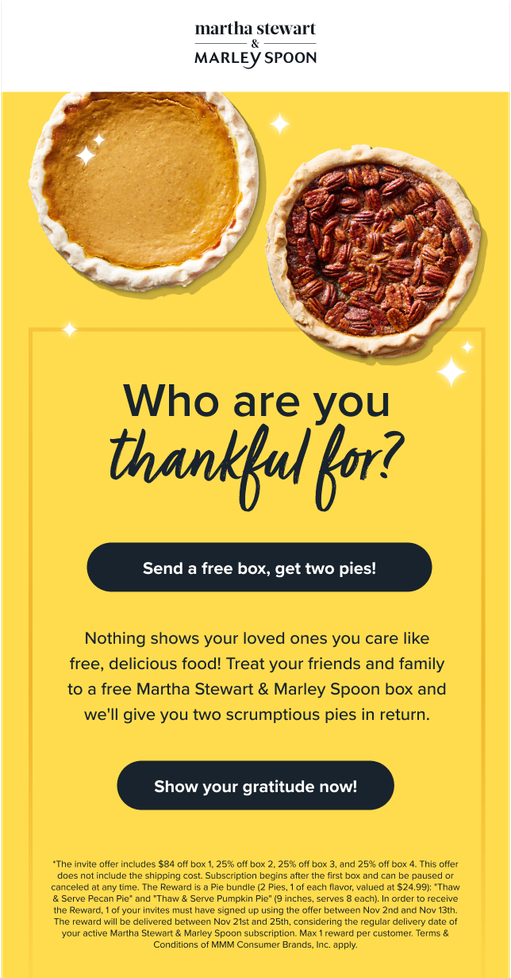
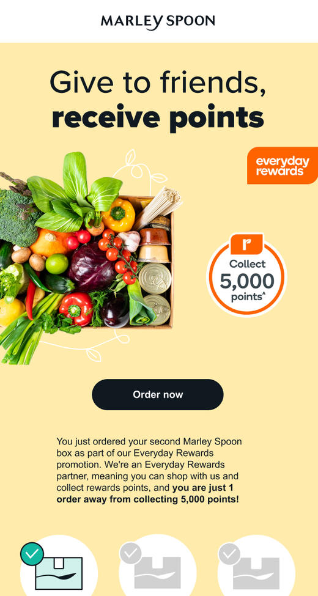
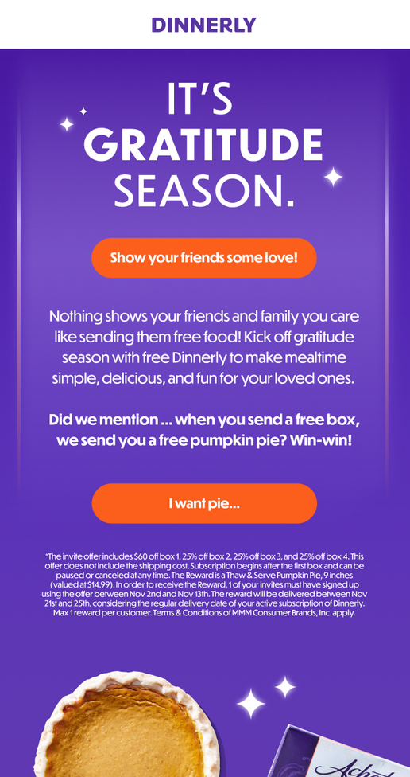

</ImageRow>

## Defining flow

Due to the success of the non-monetary reward, we decided to use the market
items as our first rewards. We are currently selling them for the customers as
add-ons apart from the meal-kit service. Market items such as desserts and
bakery sometimes resulted in waste due to the short shelf life.

For redesigning the new referral program, we identify the feature by using
problem/opportunity framework to crave out the basic fulfilments that we need to
provide to users. Then I developed a user flow for the feature to understand
where and how the feature will be organized with the current products.

<ImageRow>

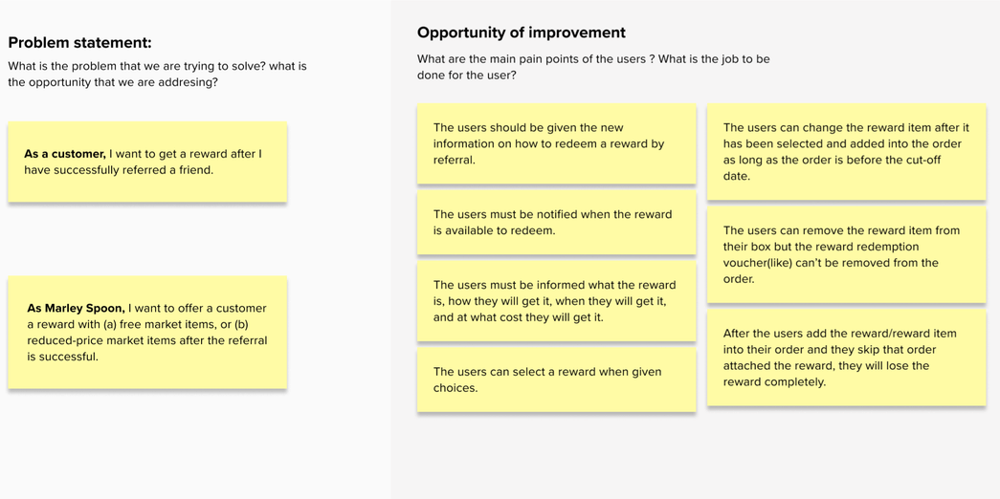 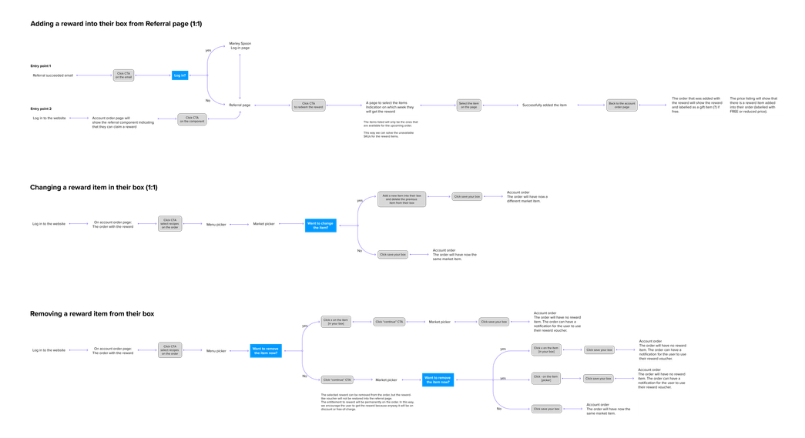

</ImageRow>

## Design Exploration

Apart from redesigning on the referral programs, I also worked with a copywriter
on communication for the new referral program. I used the new content and
explore different communication styles on the website in order to seamlessly
educate them our new program as well as getting them excited about it.

<ImageRow>

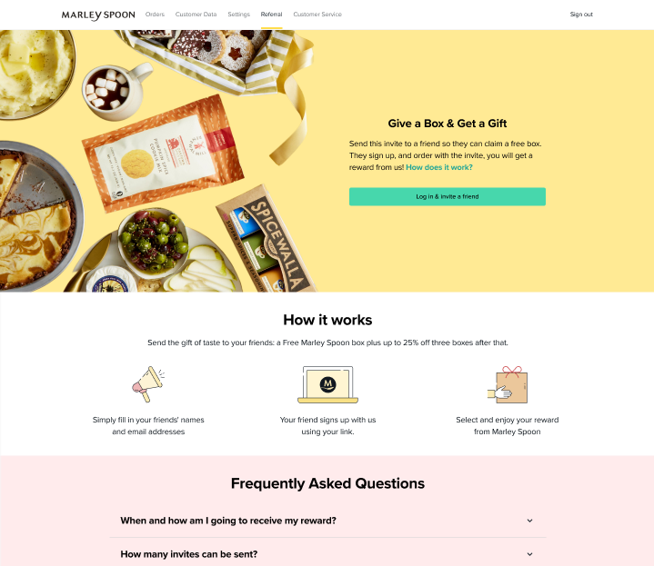
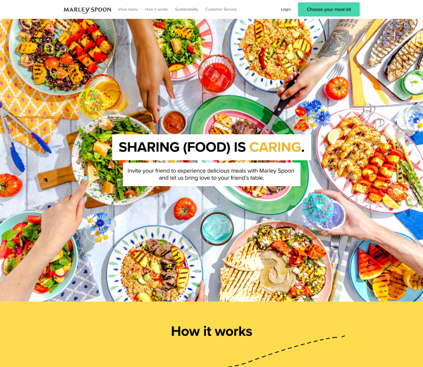

</ImageRow>

## Final UI

For the final design, not only did I include a feature for claiming a reward and
worked on content design, I also include a product page of each of available
rewards in the program showing the product description, instructions,
ingredients, and allergen for customers.

<ImageRow>

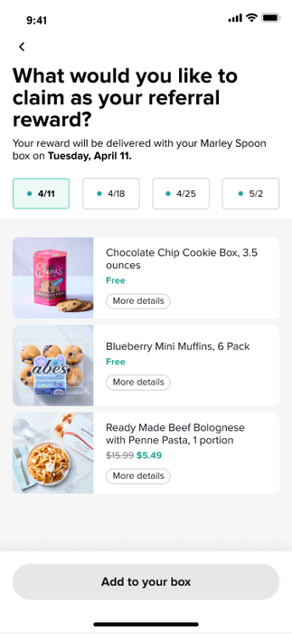 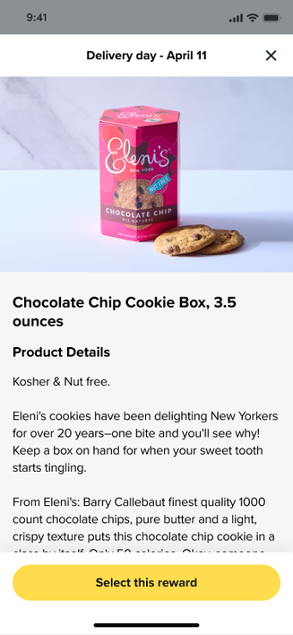
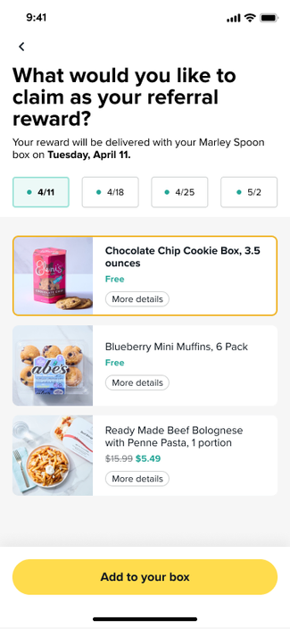 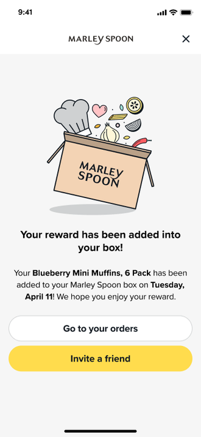

</ImageRow>

## Impact & Performance

Receiving products as a reward proved to be much more appealing to customers
than receiving discounts. **Within the first quarter, we perceived a 10%
increase in referral acquisitions. By offering the customers the market items as
a reward, we could prevent up to 30% of the food waste on the product
category**. By the end of 2023, we expect to increase the referral acquisitions
by acquiring 12k incremental customers per year and at the same time we are also
anticipating about $1M in media saving per year. We also planned a series of
experiments to ensure the best performance of the new referral such as
partnership with different brands for rewards.
