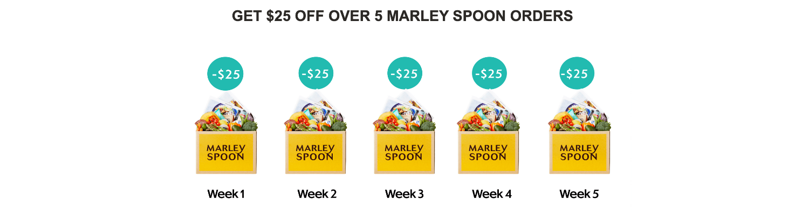
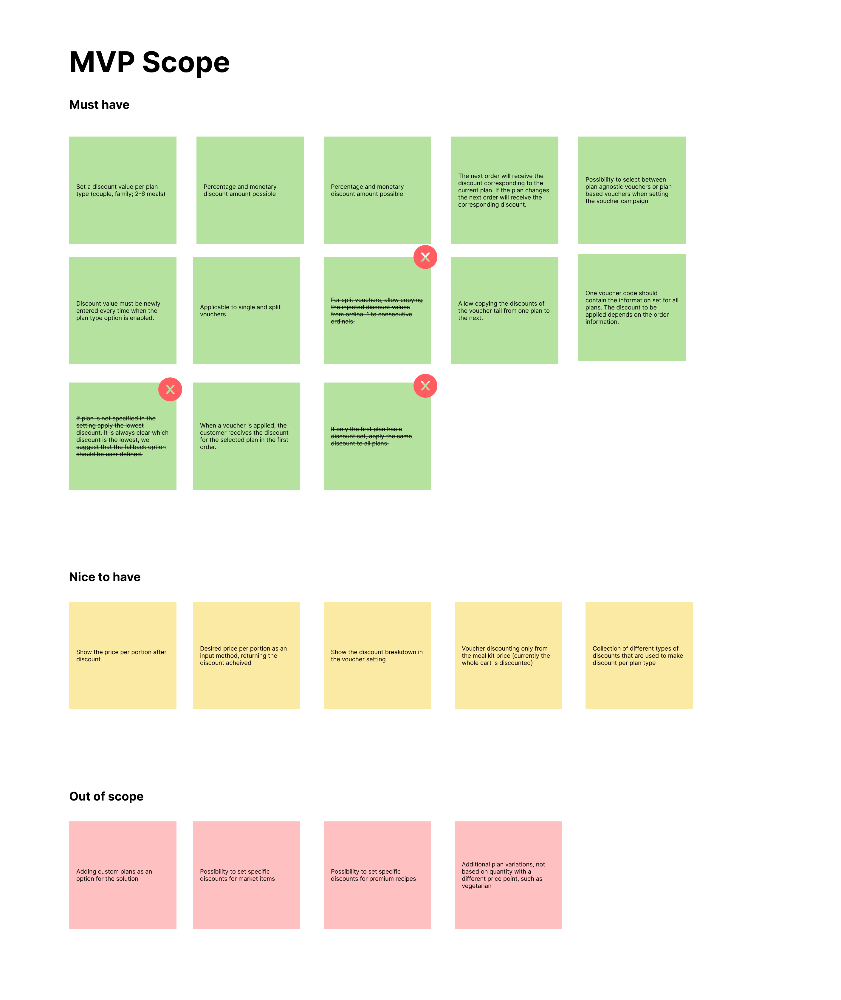
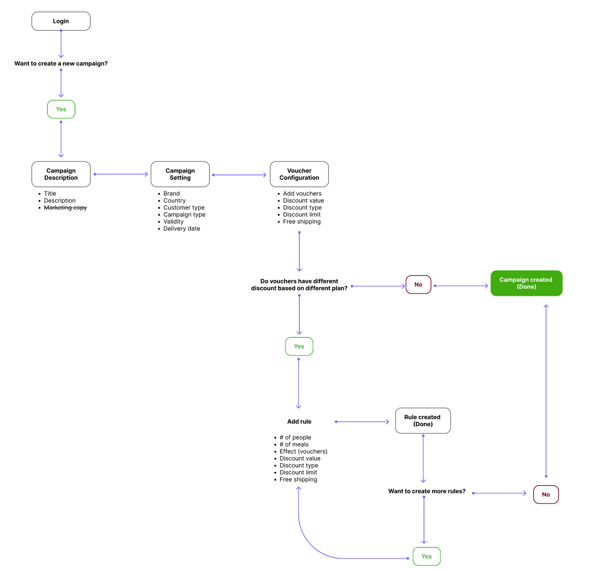
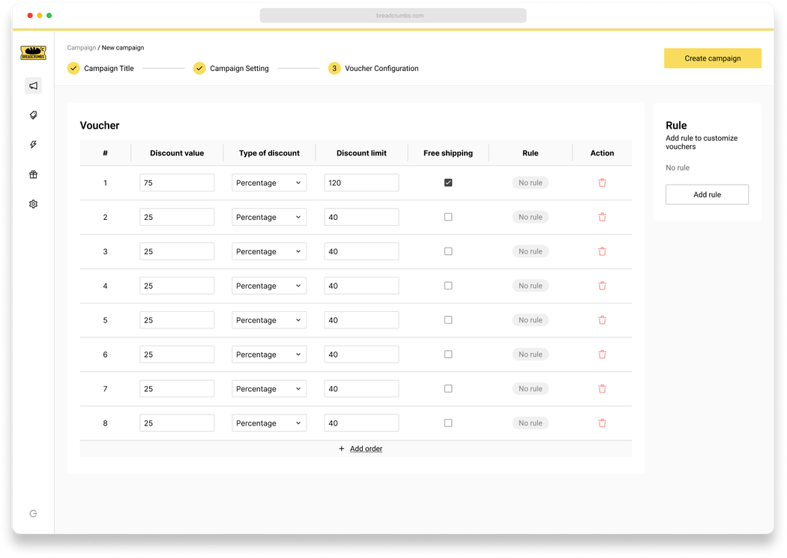
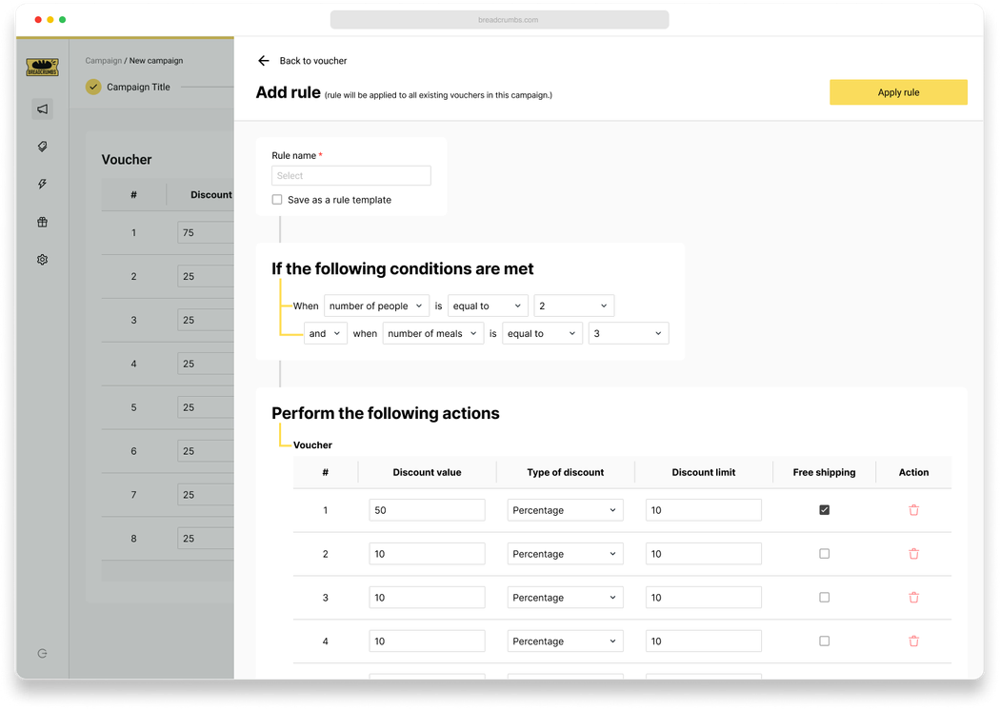
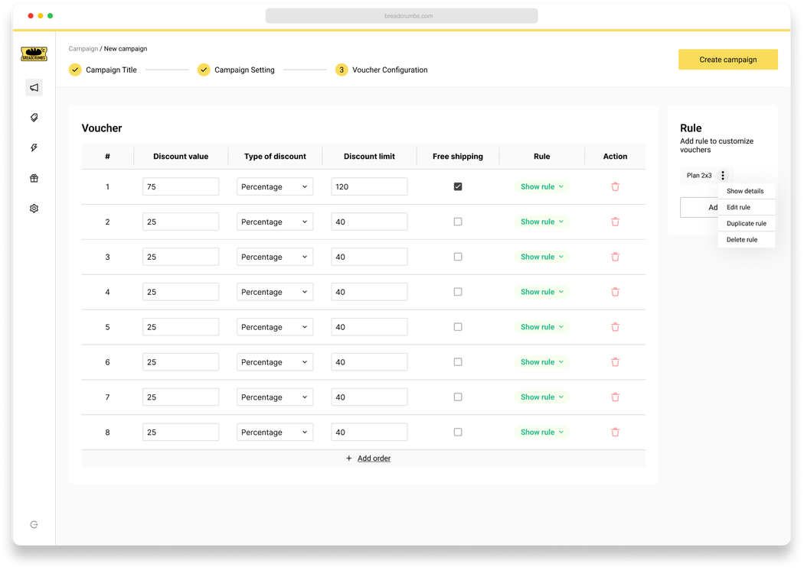
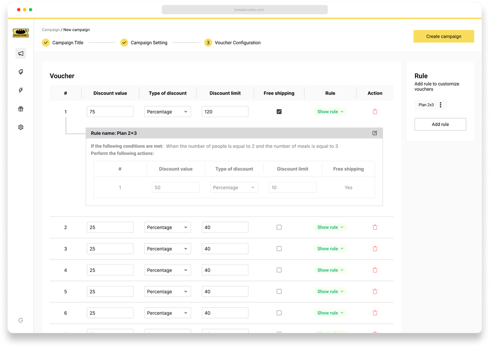
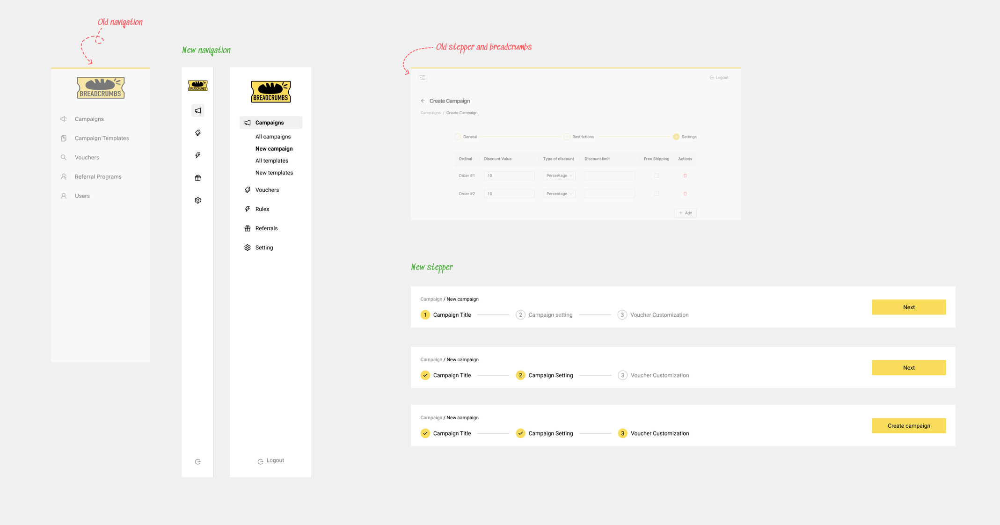

import { ImageGrid } from '@site/src/components/ImageLayout'; import Vimeo from
'@site/src/components/Vimeo';

# Designing a Rule Builder on Promotion Software

In the competitive landscape of meal kit subscriptions, Marley Spoon has made its mark by delivering convenient home-cooked experiences to customers in 7 countries, with Australia and the USA as the biggest markets. Their focus on pre-portioned ingredients and diverse recipes has resonated with those who look for quick and easy meal preparation. With subscription plans designed for two-person and four-person households, subscribers can choose up to 6 meals per week, simplifying meal planning.

Vouchers have been a mean in attracting new customers to the meal kit experience. However, the simplicity of offering flat percentage discounts has become a bit more complicated. **Offering the same discounts across all subscription plans started eating into profit margins, especially for higher-value plans.** Collaborating with product and marketing managers, we discovered a solution by introducing varying discounts linked to specific subscription plans. However, the existing promotion software caused a challenge, as it wasn't equipped for this level of customization.

## The Strategy of Split Voucher

Split voucher is a common strategy among meal kit brands to maintain subscribers over multiple weeks. These vouchers consist of two main campaigns: the **"Acquisition Voucher,"** aimed at new customers and distributed through digital and affiliate marketing, and the **"Reactivation Voucher,"** tailored for unsubscribed customers via targeted email campaigns.

## Simplifying the User Flow

During a discussion with both product and marketing teams, we outlined the essential features of the Minimum Viable Product (MVP). It became clear that the solution needed to be capable of adjusting discounts based on variables like the number of persons and the number of meals chosen on a plan.

<ImageGrid columns="2">

</ImageGrid>

## Introducing the Rule Builder

I introduced a design solution that came in the shape of **the Rule Builder** – a dynamic interface empowering marketing managers to create tailored discount formulas for various subscription plan scenarios. For example, a "Two-Person, Three-Meal" plan might trigger a 50% discount instead of the standard 75%. This customization ensures discounts align with business goals and customer preferences.

<ImageGrid columns="2">

</ImageGrid>

## Refinement through Iteration

Through design processes and rapid testing, I ensured that my solution improved to resonate better with users. I enhanced visual representations of complex rules and optimized a navigation structure transformed discount customization into an intuitive experience.

## Empowering Future Marketing Efforts

The Rule Builder's impact extended beyond immediate voucher customization. The "Rules" repository offered templates ready for future marketing campaigns. This streamlined voucher creation and set the stage for more targeted and effective marketing strategies.

<Vimeo src="https://player.vimeo.com/video/854720575" />
